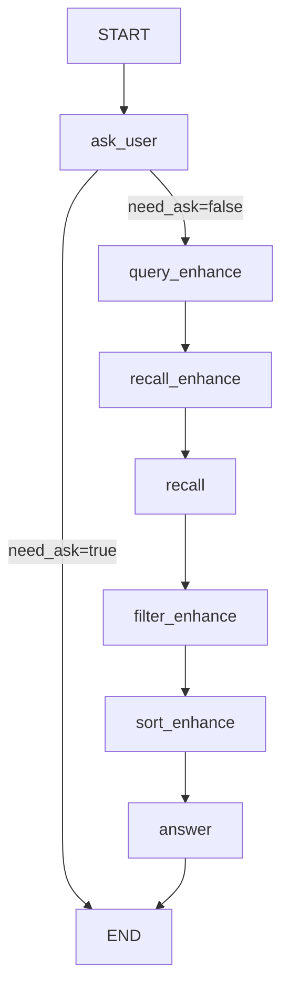

# 医疗领域文本RAG标准产品

基于LangGraph和LangChain的医学领域检索增强生成(RAG)对话系统，支持多轮对话、复杂查询增强和多种检索方式融合。

## 📋 目录

- [项目概述](#项目概述)
- [核心特性](#核心特性)
- [系统架构](#系统架构)
- [快速开始](#快速开始)
- [配置说明](#配置说明)
- [模块说明](#模块说明)
- [API文档](#api文档)
- [部署指南](#部署指南)
- [常见问题](#常见问题)

---

## 项目概述

本项目是一个专业的医疗知识问答系统，通过结合大语言模型(LLM)、向量数据库、知识图谱和网络搜索，为用户提供准确、专业的医疗知识问答服务。

### 技术栈

- **框架**: LangGraph、LangChain
- **LLM提供商**: OpenAI、Ollama、DashScope
- **向量数据库**: Milvus
- **知识图谱**: Neo4j
- **检索方式**: 向量检索、稀疏向量(BM25)、网络搜索、图谱检索
- **重排序**: Cross-Encoder、长上下文重排序

---

## 核心特性

### 🔍 多源融合检索

- **向量检索**: 支持稠密向量(cosine/IP/L2)和稀疏向量(BM25)混合检索
- **知识图谱**: 基于Neo4j的实体关系检索和向量相似度检索
- **网络搜索**: 实时获取最新医疗资讯
- **多路融合**: RRF和加权融合算法优化检索结果

### 🧠 智能查询增强

- **主动追问**: 多轮对话中智能补充关键信息
- **Query改写**: 将口语化问题转化为专业检索词
- **多查询生成**: 从不同角度生成多个检索查询
- **子查询拆分**: 将复杂问题拆解为多个独立子问题
- **上位词生成**: 生成更通用的上位问题
- **假设性答案**: 基于问题生成假设答案用于检索

### 📄 文档过滤与排序

- **相关性过滤**: 基于Embedding或LLM过滤低相关文档
- **内容压缩**: 提取与问题最相关的内容片段
- **冗余去除**: 基于向量相似度去除重复文档
- **重排序**: Cross-encoder和长上下文重排序

### 💬 多轮对话管理

- **对话历史**: 完整的多轮对话上下文管理
- **背景提取**: 从对话中自动抽取关键背景信息
- **追问机制**: 智能判断是否需要追问
- **摘要缓存**: 高效的对话摘要管理

---

## 系统架构

### 整体流程图

```
用户输入 → 主动追问 → 查询增强 → 召回增强 → 文档召回 → 文档过滤 → 文档排序 → 答案生成
   ↓          ↓          ↓          ↓          ↓          ↓          ↓          ↓
对话历史   信息补充   Query改写   多路查询   Milvus/KG/Web  相关性过滤  重排序    LLM生成
   ↓
背景提取
```

### Agent状态流转



### 项目结构

```
9.文本RAG标准产品/
├── __init__.py
├── app_config.py              # 应用配置管理
├── dialogue_agent.py          # 对话Agent核心
├── integrated_recall.py       # 集成检索模块
├── run_dialogue.py            # 主程序入口
├── templates.py               # 全局Prompt模板
├── utils.py                   # 工具函数
├── answer/                    # 答案生成模块
│   ├── __init__.py
│   ├── answer.py             # 答案生成核心逻辑
│   ├── answer_templates.py   # RAG提示模板
│   └── utils.py              # 工具函数
├── enhance/                   # 增强模块
│   ├── __init__.py
│   ├── agent_state.py        # Agent状态定义
│   ├── query_enhance.py      # 查询增强(Query改写/摘要)
│   ├── recall_enhance.py     # 召回增强(多查询/子查询)
│   ├── filter_enhance.py     # 过滤增强
│   ├── sort_enhance.py       # 排序增强
│   ├── enhance_templates.py  # 增强提示模板
│   └── utils.py              # 工具函数
├── rag/                       # RAG配置模块
│   ├── __init__.py
│   ├── rag_config.py         # 配置数据模型
│   ├── rag_config.yaml       # 配置文件
│   └── rag_loader.py         # 配置加载器
├── recall/                    # 检索模块
│   ├── milvus/               # 向量检索
│   │   ├── embed_config.py   # 配置模型
│   │   ├── embed_config.yaml # 配置文件
│   │   ├── embed_loader.py   # 配置加载
│   │   ├── embed_searcher.py # 核心检索器
│   │   ├── embed_search.py   # LangChain集成
│   │   ├── sparse_vectorizer.py # BM25实现
│   │   └── README.md
│   ├── kgraph/               # 知识图谱检索
│   │   ├── kg_config.py      # 配置模型
│   │   ├── kg_config.yaml    # 配置文件
│   │   ├── kgraph_searcher.py # 核心检索器
│   │   ├── kgraph_search.py  # LangChain集成
│   │   ├── neo4j_connection.py # Neo4j连接管理
│   │   └── README.md
│   ├── search/               # 网络搜索
│   │   ├── web_searcher.py   # 核心检索器
│   │   ├── web_search.py     # LangChain集成
│   │   └── search_utils.py   # 工具函数
│   └── __init__.py
└── test_*.py                  # 测试文件
```

---

## 快速开始

### 环境要求

- Python 3.8+
- Milvus 2.3+
- Neo4j 4.4+ (可选)

### 安装依赖

```bash
pip install -r requirements.txt
```

主要依赖：
```
langgraph>=0.0.50
langchain>=0.1.0
langchain-core>=0.1.0
langchain-community>=0.0.10
pydantic>=2.0.0
pymilvus>=2.3.0
neo4j>=5.0.0
httpx>=0.25.0
numpy>=1.24.0
```

### 配置文件

1. **RAG配置** (`rag/rag_config.yaml`)

```yaml
llm:
  provider: dashscope  # openai/ollama/dashscope
  model: qwen-plus
  api_key: your-api-key
  base_url: https://dashscope.aliyuncs.com/compatible-mode/v1
  temperature: 0.3
  max_tokens: 2048

embedding:
  provider: dashscope
  model: text-embedding-v2
  api_key: your-api-key
  dimension: 1536

reranker:
  provider: dashscope
  model: text-reranker-v2
  api_key: your-api-key

agent:
  max_ask_num: 5
  network_search_enabled: true
  network_search_cnt: 10
  kgraph_search_enabled: true
  kgraph_search_cnt: 10
  query_rewrite_enabled: true
  generate_multi_queries_enabled: false
  generate_sub_queries_enabled: false
  generate_superordinate_query_enabled: true
  generate_hypothetical_answer_enabled: true
  filter_low_correction_content_enabled: true
  filter_low_correction_doc_embeddings_enabled: true
  low_correction_threshold: 0.65
  sort_docs_cross_encoder_enabled: true
  sort_docs_by_loss_of_location_enabled: true
```

2. **向量检索配置** (`recall/milvus/embed_config.yaml`)

```yaml
milvus:
  uri: http://localhost:19530
  collection_name: medical_knowledge

dense_fields:
  chunk:
    embed: true
    provider: dashscope
    model: text-embedding-v2
    dimension: 1536
    index_field: chunk_dense
    index_type: HNSW
    metric_type: COSINE

sparse_fields:
  chunk:
    embed: true
    algorithm: BM25
    index_field: chunk_sparse
    metric_type: IP

fusion:
  method: rrf
  k: 60

default_search:
  limit: 5
  top_k: 50
```

3. **知识图谱配置** (`recall/kgraph/kg_config.yaml`)

```yaml
neo4j:
  uri: bolt://localhost:7687
  database: neo4j

embedding:
  provider: dashscope
  model: text-embedding-v2
```

### 运行示例

```bash
# 启动交互式对话
python run_dialogue.py
```

### 代码示例

```python
from app_config import APPConfig
from rag.rag_loader import RAGConfigLoader
from recall.kgraph.kg_loader import KGraphConfigLoader
from recall.milvus.embed_loader import EmbedConfigLoader
from dialogue_agent import DialogueAgent
from utils import create_llm_client, create_embedding_client, create_reranker_client

# 初始化配置
rag_config_loader = RAGConfigLoader()
milvus_config_loader = EmbedConfigLoader()
kgraph_config_loader = KGraphConfigLoader()
app_config = APPConfig(
    rag_config_loader=rag_config_loader,
    milvus_config_loader=milvus_config_loader,
    kgraph_config_loader=kgraph_config_loader
)

# 创建模型客户端
llm = create_llm_client(rag_config_loader.config.llm)
embedding = create_embedding_client(rag_config_loader.config.embedding)
reranker = create_reranker_client(rag_config_loader.config.reranker)

# 初始化Agent
agent = DialogueAgent(
    app_config=app_config,
    embeddings_model=embedding,
    llm=llm,
    reranker=reranker
)

# 提问并获取回答
state = agent.answer("什么是房颤？")
print(state["final_answer"])
```

---

## 配置说明

### LLM配置

支持三种LLM提供商：

| 提供商 | 模型示例 | 说明 |
|--------|---------|------|
| OpenAI | gpt-4, gpt-3.5-turbo | 需要API Key |
| Ollama | qwen3:4b, llama2 | 本地部署 |
| DashScope | qwen-plus, qwen-turbo | 阿里云 |

### 检索方式配置

| 配置项 | 说明 | 默认值 |
|--------|------|--------|
| network_search_enabled | 是否启用网络搜索 | false |
| kgraph_search_enabled | 是否启用知识图谱 | false |
| generate_multi_queries_enabled | 是否生成多查询 | true |
| generate_sub_queries_enabled | 是否拆分子查询 | true |
| generate_superordinate_query_enabled | 是否生成上位词 | true |
| generate_hypothetical_answer_enabled | 是否生成假设答案 | true |

### 过滤配置

| 配置项 | 说明 | 默认值 |
|--------|------|--------|
| filter_low_correction_content_enabled | 基于LLM内容过滤 | true |
| filter_low_correction_doc_llm_enabled | 基于LLM文档过滤 | false |
| filter_low_correction_doc_embeddings_enabled | 基于Embedding过滤 | true |
| low_correction_threshold | 相关性阈值 | 0.65 |
| filter_redundant_doc_embeddings_enabled | 冗余过滤 | false |
| redundant_threshold | 冗余阈值 | 0.95 |

### 排序配置

| 配置项 | 说明 | 默认值 |
|--------|------|--------|
| sort_docs_cross_encoder_enabled | Cross-encoder重排序 | true |
| sort_docs_by_loss_of_location_enabled | 长上下文重排序 | true |

---

## 模块说明

### DialogueAgent (dialogue_agent.py)

核心对话Agent，管理整个RAG流程。

**主要方法：**
- `answer(query: str)`: 处理用户查询并返回答案
- `_build_graph()`: 构建Agent图结构

**状态流转节点：**
1. `ask_user`: 判断是否需要主动追问
2. `query_enhance`: 查询增强(总结、改写)
3. `recall_enhance`: 召回增强(多查询生成)
4. `recall`: 执行文档召回
5. `filter_enhance`: 文档过滤
6. `sort_enhance`: 文档排序
7. `answer`: 生成最终答案

### IntegratedRecall (integrated_recall.py)

集成检索模块，协调多种检索方式。

**检索方式：**
- 向量检索：基于Milvus的稠密/稀疏向量检索
- 网络搜索：实时获取最新信息
- 知识图谱：基于Neo4j的实体关系检索

**主要方法：**
- `search(query: str) -> List[Document]`: 执行综合检索

### 查询增强模块 (enhance/)

#### query_enhance.py

- `query_refine()`: 判断是否需要追问关键信息
- `generate_summary()`: 从对话中提取背景信息
- `query_rewrite()`: 将口语化问题改写为专业检索词

#### recall_enhance.py

- `generate_multi_queries()`: 生成多个角度的查询
- `generate_sub_queries()`: 将复杂问题拆解为子问题
- `generate_superordinate_query()`: 生成上位问题
- `generate_hypothetical_answer()`: 生成假设性答案

#### filter_enhance.py

- `filter_low_correction_content()`: 基于LLM过滤无关内容
- `filter_low_correction_doc_llm()`: 基于LLM过滤低相关文档
- `filter_low_correction_doc_embeddings()`: 基于Embedding过滤
- `filter_redundant_doc_embeddings()`: 去除重复文档

#### sort_enhance.py

- `sort_docs_cross_encoder()`: 基于Cross-Encoder重排序
- `sort_docs_by_loss_of_location()`: 长上下文重排序

### 检索模块 (recall/)

#### Milvus向量检索

支持稠密向量和稀疏向量(BM25)混合检索，支持RRF和加权融合。

**特性：**
- 支持OpenAI/Ollama/DashScope多种嵌入模型
- 支持HNSW/IVF_FLAT等多种索引类型
- 支持COSINE/IP/L2多种距离度量
- 支持多路向量融合

#### 知识图谱检索

基于Neo4j的知识图谱检索，支持向量相似度检索和关系检索。

**特性：**
- 实体向量相似度检索
- 关键词检索
- 关系检索(1跳、2跳等)
- 多Provider嵌入模型支持

#### 网络搜索

实时网络搜索，获取最新医疗资讯。

### 答案生成模块 (answer/)

基于检索到的文档生成专业、准确的医疗答案。

**特性：**
- 严格基于参考资料回答
- 明确说明无法回答的问题
- 专业、准确、通俗易懂
- 涉及诊疗建议时提醒咨询专业医生

---

## API文档

### DialogueAgent

```python
class DialogueAgent:
    def __init__(
        self,
        app_config: APPConfig,
        embeddings_model: Embeddings,
        llm: BaseChatModel,
        reranker: DashScopeRerank
    )
    
    def answer(self, query: str) -> AgentState:
        """
        处理用户查询并返回答案
        
        Args:
            query: 用户查询文本
            
        Returns:
            AgentState: 包含答案和相关信息的字典
        """
```

### IntegratedRecall

```python
class IntegratedRecall:
    def __init__(
        self,
        app_config: APPConfig,
        llm: BaseChatModel,
        embed_model: Embeddings = None
    )
    
    def search(self, query: str) -> List[Document]:
        """
        执行综合检索
        
        Args:
            query: 查询文本
            
        Returns:
            List[Document]: 检索到的文档列表
        """
```

---

## 部署指南

### 部署Milvus

使用Docker快速部署：

```bash
docker run -d --name milvus-standalone \
  -p 19530:19530 \
  -p 9091:9091 \
  milvusdb/milvus:latest
```

### 部署Neo4j

使用Docker快速部署：

```bash
docker run -d --name neo4j \
  -p 7474:7474 -p 7687:7687 \
  -e NEO4J_AUTH=neo4j/password \
  neo4j:latest
```

### 生产环境部署

建议使用：
- **容器化**: Docker/Kubernetes
- **负载均衡**: Nginx/Traefik
- **监控**: Prometheus/Grafana
- **日志**: ELK Stack/Loki

---

## 常见问题

### Q: 如何切换LLM提供商？

修改 `rag/rag_config.yaml` 中的 `llm.provider` 字段：

```yaml
llm:
  provider: ollama  # 改为 openai/dashscope
  base_url: http://localhost:11434
```

### Q: 如何调整召回数量？

修改配置文件中的 `limit` 和 `top_k` 参数：

```yaml
default_search:
  limit: 5    # 最终返回数量
  top_k: 50   # 检索数量
```

### Q: 如何启用/禁用某种检索方式？

修改 `rag/rag_config.yaml` 中的对应开关：

```yaml
agent:
  network_search_enabled: false    # 禁用网络搜索
  kgraph_search_enabled: false     # 禁用知识图谱
```

### Q: 如何调整相关性阈值？

修改过滤配置中的阈值：

```yaml
agent:
  low_correction_threshold: 0.7    # 提高相关性要求
  redundant_threshold: 0.90       # 降低去重敏感度
```

### Q: 如何优化性能？

1. **并行检索**: 启用多线程并行执行多个查询
2. **缓存**: 启用对话摘要缓存
3. **索引优化**: 选择合适的索引类型和参数
4. **批量处理**: 使用批量API减少网络请求

---

## 贡献指南

欢迎提交Issue和Pull Request！

### 开发规范

- 遵循PEP 8代码规范
- 添加类型注解
- 编写单元测试
- 更新文档

---

## 许可证

[MIT License](LICENSE)

---

## 联系方式

- 项目地址: [GitHub]
- 问题反馈: [Issues]

---

## 更新日志

### v1.0.0 (2024-01-31)

- 初始版本发布
- 支持多轮对话、多源检索、查询增强
- 支持Milvus、Neo4j、网络搜索
- 完整的配置管理和文档
