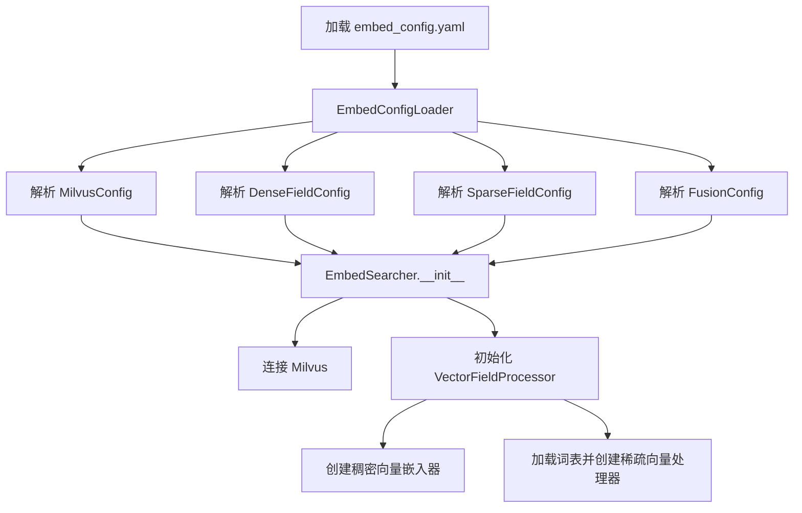
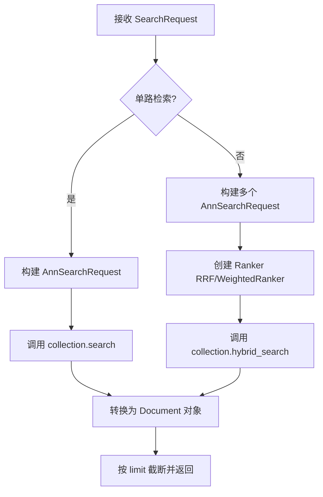
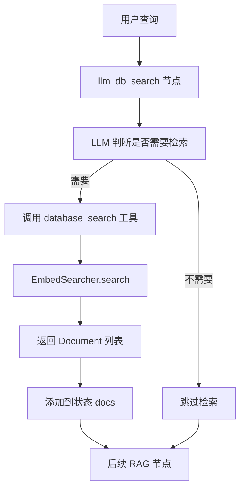

# Milvus 向量检索模块

基于 Milvus 的医疗知识库向量检索模块，支持稠密向量检索、稀疏向量(BM25)检索和多路向量融合。

## 1. 文件结构

```
milvus/
├── __init__.py              # 模块入口，导出主要接口
├── embed_config.py          # 配置数据模型定义
├── embed_config.yaml        # 配置文件（Milvus连接、向量字段、融合参数等）
├── embed_loader.py          # 配置加载器（支持环境变量替换）
├── embed_search.py          # 检索节点和工具创建（与 LangChain Agent 集成）
├── embed_searcher.py        # 核心检索器（混合检索、向量融合）
├── embed_utils.py           # 工具函数（嵌入客户端创建、JSON转换等）
├── embed_vocab.py           # 词表管理（用于稀疏向量/BM25）
├── embedding_client.py      # 嵌入模型客户端工厂（OpenAI/Ollama/DashScope）
├── sparse_vectorizer.py     # 稀疏向量处理器（BM25算法实现）
├── embed_templates.py      # Prompt模板定义
└── vocab/                   # 词表存储目录
    └── vocab.pkl.gz         # BM25词表文件
```

## 2. 核心模块说明

### 2.1 配置模块

| 文件 | 说明 |
|------|------|
| `embed_config.py` | 定义所有配置的 Pydantic 模型，包括 MilvusConfig、DenseFieldConfig、SparseFieldConfig、FusionConfig 等 |
| `embed_config.yaml` | 实际配置文件，与索引构建模块完全对齐 |
| `embed_loader.py` | 配置加载器，支持环境变量替换（如 `${MILVUS_URI}`） |

### 2.2 检索模块

| 文件 | 说明 |
|------|------|
| `embed_searcher.py` | 核心检索器 `EmbedSearcher`，支持多路向量检索 + RRF/加权融合 |
| `embed_search.py` | LangChain Agent 集成，提供 `llm_db_search` 节点和 `database_search` 工具 |

### 2.3 向量化模块

| 文件 | 说明 |
|------|------|
| `embedding_client.py` | 嵌入模型客户端工厂，支持 OpenAI、Ollama、DashScope |
| `sparse_vectorizer.py` | BM25 稀疏向量处理器，支持并行分词 |
| `embed_vocab.py` | 词表管理类 Vocabulary，维护 token→id 和 id→df 映射 |

### 2.4 工具模块

| 文件 | 说明 |
|------|------|
| `embed_utils.py` | 工具函数：创建嵌入客户端、JSON转Document、判断是否调用工具等 |
| `embed_templates.py` | Prompt 模板注册表 |

## 3. 代码流程

### 3.1 初始化流程



### 3.2 检索流程



### 3.3 向量编码流程

```mermaid
graph TD
    A[查询文本 + anns_field] --> B{稠密向量?}
    B -->|是| C[查找 DenseFieldConfig]
    B -->|否| D[查找 SparseFieldConfig]
    C --> E[调用对应嵌入器 embed_query]
    D --> F[分词 + BM25 计算]
    E --> G[返回 List[float]]
    F --> H[返回 Dict[int,float]]
```

### 3.4 Agent 集成流程



## 4. 使用示例

### 4.1 基础检索

```python
from recall.milvus.embed_loader import EmbedConfigLoader
from recall.milvus.embed_searcher import get_kb
from recall.milvus.embed_config import SearchRequest, FusionSpec, SingleSearchRequest

# 加载配置
config = EmbedConfigLoader()

# 获取知识库实例（单例模式）
kb = get_kb(config.as_dict)

# 构建检索请求
search_req = SearchRequest(
    query="糖尿病的常见症状有哪些？",
    collection_name="medical_knowledge",
    requests=[
        SingleSearchRequest(
            anns_field="chunk_dense",
            limit=50,
            search_params={"ef": 64},
            metric_type="COSINE"
        ),
        SingleSearchRequest(
            anns_field="parent_chunk_dense",
            limit=50,
            search_params={"ef": 64},
            metric_type="COSINE"
        ),
        SingleSearchRequest(
            anns_field="questions_dense",
            limit=50,
            search_params={"ef": 64},
            metric_type="COSINE"
        )
    ],
    fuse=FusionSpec(method="rrf", k=60),
    top_k=50,
    limit=5
)

# 执行检索
results = kb.search(search_req)

# 处理结果
for doc in results:
    print(doc.page_content)
    print(doc.metadata)
```

### 4.2 与 LangChain Agent 集成

```python
from langchain_openai import ChatOpenAI
from recall.milvus.embed_loader import EmbedConfigLoader
from recall.milvus.embed_search import create_db_search_tool, llm_db_search
from langgraph.prebuilt import ToolNode

# 加载配置
config = EmbedConfigLoader()

# 初始化 LLM
llm = ChatOpenAI(
    model="qwen3:4b",
    temperature=0.1,
    base_url="http://localhost:11434/v1"
)

# 创建数据库检索工具
db_search_tool, db_search_llm, db_tool_node = create_db_search_tool(
    embed_config_loader=config,
    power_model=llm
)

# 在 Agent 图中使用
state = {
    "query": "高血压的治疗方法",
    "main_messages": [],
    "other_messages": [],
    "docs": [],
    "answer": "",
    "retry": 0,
    "final": "",
    "judge_result": ""
}

state = llm_db_search(
    state=state,
    llm=db_search_llm,
    db_tool_node=db_tool_node,
    show_debug=True
)
```

## 5. 配置说明

### 5.1 Milvus 配置

```yaml
milvus:
  uri: http://localhost:19530    # Milvus 服务地址
  token: null                    # 认证令牌（可选）
  collection_name: medical_knowledge  # 集合名称
  drop_old: false                # 是否删除旧集合
  auto_id: false                 # 是否使用自动 ID
```

### 5.2 稠密向量字段配置

```yaml
dense_fields:
  chunk:
    embed: true                  # 是否生成嵌入
    type: str                    # 字段类型
    provider: dashscope           # 提供商: openai/ollama/dashscope
    model: text-embedding-v2     # 模型名称
    api_key: sk-xxx              # API 密钥
    base_url: https://...        # API 基础 URL
    dimension: 1536              # 向量维度
    workers: 8                   # 并发数
    index_field: chunk_dense     # 索引字段名
    index_type: HNSW             # 索引类型
    index_params:
      M: 32
      efConstruction: 200
    search_params:
      ef: 64
    metric_type: COSINE          # 距离度量: COSINE/IP/L2
```

### 5.3 稀疏向量字段配置

```yaml
sparse_fields:
  chunk:
    embed: true
    vocab_path: vocab.pkl.gz    # 词表路径
    algorithm: BM25             # 算法: BM25
    k1: 1.5                     # BM25 k1 参数
    b: 0.75                     # BM25 b 参数
    domain_model: medicine      # 领域模型（分词）
    workers: 8                  # 并发数
    index_field: chunk_sparse   # 索引字段名
    index_type: SPARSE_INVERTED_INDEX
    index_params:
      inverted_index_algo: DAAT_MAXSCORE
    metric_type: IP             # 距离度量: IP/BM25
```

### 5.4 检索融合配置

```yaml
fusion:
  method: rrf                   # 融合方法: rrf/weighted
  k: 60                        # RRF 的 k 值
  weights:                     # 加权融合的权重
    chunk_dense: 0.35
    parent_chunk_dense: 0.35
    questions_dense: 0.20
    chunk_sparse: 0.10
```

### 5.5 默认检索配置

```yaml
default_search:
  limit: 5                     # 最终返回数量
  top_k: 50                    # 融合时每个子请求的返回数量
  output_fields:               # 输出字段
    - chunk
    - parent_chunk
    - summary
    - questions
    - document
    - source
    - source_name
```

## 6. 支持的嵌入提供商

| 提供商 | 说明 | 配置参数 |
|--------|------|----------|
| OpenAI | OpenAI 嵌入 API | model, api_key, base_url |
| Ollama | 本地 Ollama 服务 | model, base_url |
| DashScope | 阿里云 DashScope | model, api_key, base_url |

## 7. 关键类和函数

| 类/函数 | 说明 |
|---------|------|
| `EmbedSearcher` | 核心检索器，支持混合检索和向量融合 |
| `VectorFieldProcessor` | 向量字段处理器，管理稠密和稀疏向量 |
| `SparseVectorProcessor` | BM25 稀疏向量处理器 |
| `Vocabulary` | 词表管理类，维护 token→id 和 id→df 映射 |
| `EmbedConfigLoader` | 配置加载器 |
| `get_kb()` | 获取知识库单例实例 |
| `create_db_search_tool()` | 创建数据库检索工具 |
| `llm_db_search()` | LLM 数据库检索节点 |
| `create_embedding_client()` | 创建嵌入客户端 |

## 8. 运行测试

```bash
cd c:/code/7-医疗大模型/qwen3-medical-rag/9.文本RAG标准产品/milvus
python embed_search.py
```

测试内容：
1. 加载配置
2. 初始化 LLM
3. 创建数据库检索工具
4. 执行数据库检索
5. 输出检索结果
